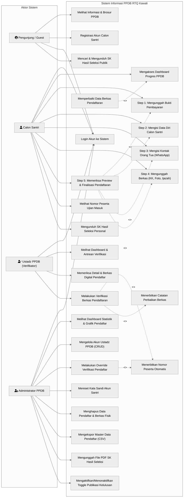

# DOKUMEN ANALISIS SISTEM INFORMASI PENERIMAAN PESERTA DIDIK BARU (PPDB)
**Project:** Sistem Informasi Akademik & PPDB RTQ Kawali (Laravel 12)  
**Keperluan:** Tugas Akhir / Capstone Project  
**Penyusun:** System Analyst & Senior Software Engineer  
**Tanggal Analisis:** 27 September 2026  
**Status Dokumen:** Final / Verified against Codebase

---

## 1. PENDAHULUAN & GAMBARAN UMUM SISTEM

Modul **PPDB (Penerimaan Peserta Didik Baru)** pada aplikasi RTQ Kawali merupakan subsistem berbasis web yang menangani siklus hidup pendaftaran calon santri baru secara berjenjang (*stepped wizard workflow*), verifikasi berkas oleh panitia (Ustadz PPDB), supervisi administratif, hingga publikasi dan pengunduhan Surat Keputusan (SK) Hasil Seleksi Kelulusan.

Aplikasi dibangun menggunakan framework **Laravel 12**, arsitektur MVC, Blade templating engine, database relasional MySQL/MariaDB dengan Eloquent ORM, serta otentikasi berbasis session dengan middleware pembatasan hak akses berbasis peran (*Role-Based Access Control / RBAC*).

---

## 2. IDENTIFIKASI AKTOR & MATRIKS HAK AKSES

Berdasarkan analisis file [routes/web.php](file:///d:/A.Firman/Project%20Web/RtqKawali-Laravel12/routes/web.php), [RoleMiddleware.php](file:///d:/A.Firman/Project%20Web/RtqKawali-Laravel12/app/Http/Middleware/RoleMiddleware.php), serta controller terkait, diidentifikasi 4 (empat) aktor utama yang berinteraksi dengan modul PPDB:

### 2.1. Profil Aktor

| No | Aktor | Identifier Role | Deskripsi Peran |
|---|---|---|---|
| 1 | **Pengunjung / Publik** | *Guest* (Unauthenticated) | Masyarakat umum, calon pendaftar, atau wali santri yang belum memiliki akun. Dapat melihat profil, brosur informasi, serta memantau pengumuman kelulusan terbuka. |
| 2 | **Calon Santri / Wali Santri** | `calon_santri` | Pengguna terdaftar yang melakukan proses pendaftaran mandiri secara bertahap (5 langkah wizard), mengunggah berkas, mengajukan finalisasi, melakukan revisi data jika ditolak, serta mengunduh berkas SK kelulusan. |
| 3 | **Ustadz PPDB (Verifikator)** | `ustadz_ppdb` | Panitia verifikasi yang bertugas meninjau kelengkapan berkas fisik/digital pendaftar, memeriksa kesesuaian data, meloloskan verifikasi (yang memicu generate nomor peserta ujian), atau menolak berkas dengan catatan perbaikan. |
| 4 | **Administrator Sistem** | `admin` | Panitia pengelola / pimpinan dengan hak akses tertinggi. Bertanggung jawab atas pengelolaan akun Ustadz, override kelolosan pendaftar, reset kata sandi, penghapusan data (beserta berkas fisik), ekspor data master ke CSV, serta pengunggahan dan publikasi SK kelulusan akhir. |

---

### 2.2. Matriks Hak Akses Fitur (Access Control Matrix)

| Fitur / Endpoint Modul PPDB | Publik (Guest) | Calon Santri (`calon_santri`) | Ustadz PPDB (`ustadz_ppdb`) | Admin (`admin`) |
|---|:---:|:---:|:---:|:---:|
| **Melihat Landing Page & Brosur Info PPDB** (`/`, `/informasi-ppdb`) |  |  |  |  |
| **Registrasi Akun Baru** (`/ppdb/register`) |  | ❌ *(Redirect)* | ❌ *(Redirect)* | ❌ *(Redirect)* |
| **Login Sistem** (`/login`) |  | ❌ *(Auth)* | ❌ *(Auth)* | ❌ *(Auth)* |
| **Logout Sistem** (`/logout`) | ❌ |  |  |  |
| **Dashboard Pendaftaran Calon Santri** (`/ppdb/dashboard`) | ❌ |  | ❌ *(403/Redirect)* | ❌ *(403/Redirect)* |
| **Step 1: Upload Bukti Pembayaran** (`/ppdb/step/1`) | ❌ |  | ❌ | ❌ |
| **Step 2: Input & Simpan Data Diri** (`/ppdb/step/2`) | ❌ |  | ❌ | ❌ |
| **Step 3: Input Kontak Orang Tua** (`/ppdb/step/3`) | ❌ |  | ❌ | ❌ |
| **Step 4: Upload Berkas Dokumen** (`/ppdb/step/4`) | ❌ |  | ❌ | ❌ |
| **Step 5: Finalisasi & Penguncian Data** (`/ppdb/step/5`) | ❌ |  | ❌ | ❌ |
| **Revisi Berkas (Saat status `perlu_perbaikan`)** | ❌ |  | ❌ | ❌ |
| **Download SK Kelulusan Personal** (`/ppdb/download-hasil-seleksi`) | ❌ |  *(Jika rilis)* | ❌ | ❌ |
| **Pencarian Publik & Download SK Kelulusan** (`/ppdb/hasil-seleksi`) |  *(Jika rilis)* |  *(Jika rilis)* |  *(Jika rilis)* |  *(Jika rilis)* |
| **Dashboard Monitoring Verifikator** (`/ustadz/dashboard`) | ❌ | ❌ |  | ❌ |
| **Review & Verifikasi Berkas Pendaftar** (`/ustadz/pendaftar/*`) | ❌ | ❌ |  | ❌ |
| **Dashboard Monitoring Admin PPDB** (`/admin/dashboard`) | ❌ | ❌ | ❌ |  |
| **Manajemen Pendaftar (Hapus & Reset Password)** (`/admin/pendaftar/*`) | ❌ | ❌ | ❌ |  |
| **Override Verifikasi Pendaftar** (`/admin/pendaftar/{id}/override`) | ❌ | ❌ | ❌ |  |
| **Manajemen Akun Ustadz PPDB (CRUD)** (`/admin/ustadz/*`) | ❌ | ❌ | ❌ |  |
| **Ekspor Data Pendaftar ke CSV** (`/admin/export-csv`) | ❌ | ❌ | ❌ |  |
| **Upload SK Kelulusan PDF** (`/admin/hasil-seleksi/{id}/upload`) | ❌ | ❌ | ❌ |  |
| **Toggle Buka/Tutup Publikasi Kelulusan** (`/admin/hasil-seleksi/toggle`) | ❌ | ❌ | ❌ |  |

---

## 3. USE CASE DIAGRAM (MERMAID.JS)

Diagram Use Case berikut memetakan relasi fungsional antar aktor, batasan sistem (*system boundary*), serta relasi ketergantungan `<<include>>` dan `<<extend>>` sesuai implementasi kode sumber.

---

## 4. TABEL SKENARIO USE CASE DETAIL

Berikut adalah rincian skenario Use Case untuk 6 (enam) fungsionalitas inti modul PPDB:

---

### Skenario 1: Registrasi Akun Calon Santri (UC-PPDB-01)

| Elemen | Deskripsi Rinci |
|---|---|
| **Use Case ID & Nama** | **UC-PPDB-01: Registrasi Akun Calon Santri** |
| **Aktor Utama** | Calon Santri / Wali Santri (*Guest*) |
| **Tujuan** | Membuat identitas akun baru untuk mengakses portal pendaftaran santri baru RTQ Kawali |
| **Pre-condition** | 1. Pengguna belum login ke sistem. 2. Halaman registrasi `/ppdb/register` dapat diakses. |
| **Post-condition** | Akun pengguna baru dengan `role = 'calon_santri'` terbentuk di database, otomatis login ke sesi, dan diarahkan ke Dashboard PPDB. |
| **Trigger** | Calon santri menekan tombol "Daftar Sekarang" pada halaman landing page atau halaman login. |

#### Alur Utama (Main Flow)
| Langkah | Aksi Aktor | Respon Sistem |
|:---:|---|---|
| 1 | Calon santri membuka URL `/ppdb/register`. | Sistem menampilkan formulir registrasi akun (Nama Lengkap, Nomor HP/WhatsApp, Kata Sandi, Konfirmasi Kata Sandi, dan Ceklis Persyaratan). |
| 2 | Calon santri mengisi data: Nama Lengkap, Nomor WhatsApp (awalan `08xxx`), Kata Sandi (minimal 8 karakter), Konfirmasi Kata Sandi, serta mencentang persetujuan syarat. | Sistem menerima input pengguna. |
| 3 | Calon santri menekan tombol "Buat Akun Sekarang". | Sistem memvalidasi input:  - `name`: string, required, max 255. - `phone`: required, regex `/^08[0-9]{8,13}$/`, unique pada tabel `users`. - `password`: required, min 8, confirmed. - `terms`: accepted. |
| 4 | - | Sistem mengenkripsi kata sandi menggunakan algoritma Hash Bcrypt. |
| 5 | - | Sistem menyimpan entitas baru ke tabel `users` dengan atribut `role = 'calon_santri'`. |
| 6 | - | Sistem melakukan `Auth::login($user)` untuk menginisialisasi sesi otentikasi. |
| 7 | - | Sistem mengarahkan browser ke rute `ppdb.dashboard` disertai flash notification pesan sukses. |

#### Alur Alternatif / Pengecualian (Alternative / Exception Flow)
- **4a. Nomor HP sudah terdaftar:**
  - Sistem menggagalkan proses penyimpanan.
  - Sistem mengembalikan pengguna ke form registrasi dengan input sebelumnya (kecuali password) dan menampilkan pesan kesalahan: *"Nomor telepon sudah terdaftar."*
- **4b. Format Nomor HP tidak valid:**
  - Nomor tidak diawali dengan `08` atau panjang digit di luar 10-15 digit.
  - Sistem menampilkan pesan: *"Format nomor telepon tidak valid (08xxxxxxxxxx)."*
- **4c. Konfirmasi Kata Sandi tidak cocok atau panjang < 8 karakter:**
  - Sistem menampilkan pesan validasi: *"Konfirmasi password tidak cocok"* atau *"Password minimal 8 karakter."*
- **4d. Syarat dan Ketentuan tidak dicentang:**
  - Sistem menampilkan pesan: *"Anda harus menyetujui syarat & ketentuan."*

---

### Skenario 2: Otentikasi & Login Multi-Aktor (UC-PPDB-02)

| Elemen | Deskripsi Rinci |
|---|---|
| **Use Case ID & Nama** | **UC-PPDB-02: Otentikasi dan Login Multi-Aktor** |
| **Aktor Utama** | Calon Santri, Ustadz PPDB, Administrator, Santri/Ustadz SIAKAD |
| **Tujuan** | Mengotentikasi pengguna ke dalam sistem dan mendistribusikan navigasi sesuai peran otoritasnya |
| **Pre-condition** | Pengguna belum masuk ke sistem dan berada pada halaman login `/login`. |
| **Post-condition** | Sesi pengguna divalidasi, sesi di-regenerasi (pencegahan Session Fixation), dan diarahkan ke dashboard role masing-masing. |
| **Trigger** | Pengguna mengakses menu login dan memasukkan kredensial akun. |

#### Alur Utama (Main Flow)
| Langkah | Aksi Aktor | Respon Sistem |
|:---:|---|---|
| 1 | Pengguna mengakses halaman login `/login`. | Sistem menampilkan form login dengan input: Identifier (`login`) dan Kata Sandi (`password`). |
| 2 | Pengguna menginput Nomor HP atau NIS beserta Kata Sandi, lalu menekan tombol "Masuk". | Sistem menerima kiriman data request. |
| 3 | - | Sistem memeriksa input identitas: pertama memeriksa tabel `santris` berdasarkan NIS. Jika ditemukan, sistem mencocokkan hash password user terkait. Jika tidak, sistem memverifikasi `phone` dan `password` pada tabel `users`. |
| 4 | - | Sistem memverifikasi kecocokan hash password (`Hash::check`). |
| 5 | - | Kredensial valid. Sistem memperbarui session token (`$request->session()->regenerate()`). |
| 6 | - | Sistem menjalankan fungsi `redirectByRole()` untuk memeriksa atribut `$user->role`:  - `admin` ➔ diarahkan ke `admin.dashboard` - `ustadz_ppdb` ➔ diarahkan ke `ustadz.dashboard` - `calon_santri` ➔ diarahkan ke `ppdb.dashboard` - `ustadz_halaqah` ➔ diarahkan ke `siakad.ustadz.dashboard` - `santri` ➔ diarahkan ke `siakad.santri.dashboard`. |

#### Alur Alternatif / Pengecualian (Alternative / Exception Flow)
- **3a / 4a. Kredensial tidak cocok:**
  - Sistem mendeteksi nomor telepon tidak terdaftar atau kata sandi salah.
  - Sistem mengembalikan pengguna ke halaman login dengan input sebelumnya dan menampilkan pesan kesalahan: *"Nomor telepon/NIS atau password salah."*
- **1a. Pengguna telah login mengakses `/login`:**
  - Sistem mendeteksi `Auth::check() == true`.
  - Sistem langsung melakukan bypass redirect ke dashboard sesuai rolenya tanpa menampilkan form login.

---

### Skenario 3: Pengisian Formulir & Berkas Berjenjang (Step 1 - Step 5) (UC-PPDB-03)

| Elemen | Deskripsi Rinci |
|---|---|
| **Use Case ID & Nama** | **UC-PPDB-03: Pengisian Formulir & Unggah Berkas Berjenjang (Step 1 s.d Step 5)** |
| **Aktor Utama** | Calon Santri / Wali Santri |
| **Tujuan** | Menyelesaikan seluruh tahapan pendaftaran digital (pembayaran, identitas diri, kontak, berkas fisik, dan finalisasi pengajuan) |
| **Pre-condition** | Calon santri telah berhasil login dan memiliki record pendaftaran di tabel `ppdb_registrations`. Form pendaftaran belum berstatus final terkunci. |
| **Post-condition** | Berkas tersimpan di storage lokal terproteksi (`ppdb`), status tahapan terbarui, `finalisasi_at` tercatat, dan status verifikasi berubah menjadi `menunggu_verifikasi_berkas`. |
| **Trigger** | Calon santri memilih langkah yang aktif pada dashboard pendaftaran. |

#### Alur Utama (Main Flow)
| Langkah | Aksi Aktor | Respon Sistem |
|:---:|---|---|
| 1 | Calon santri membuka `/ppdb/dashboard`. | Sistem memeriksa kepemilikan data `ppdb_registrations`. Jika belum ada, sistem otomatis meng-create record awal tahun ajaran aktif. Sistem menghitung persentase progres dan merender status 7 langkah. |
| 2 | Calon santri memilih **Step 1 (Pembayaran)** pada `/ppdb/step/1`, memilih file bukti transfer format PDF (maks 1MB), lalu menekan tombol "Upload". | Sistem memvalidasi mime type `pdf` dan ukuran file. File lama dihapus (jika ada), file baru disimpan di storage disk `ppdb/{user_id}/bukti_pembayaran.pdf`. Sistem memperbarui `status_pembayaran = 'diterima'` sehingga membuka hak akses Step 2. |
| 3 | Calon santri masuk ke **Step 2 (Data Diri)** pada `/ppdb/step/2`, mengisi identitas lengkap: Tempat/Tgl Lahir, Asal Sekolah, NISN, Riwayat Hafalan Quran, Urutan Lahir, Data Orang Tua, dan Alamat Rumah. Calon santri menekan "Simpan Data Diri". | Sistem memvalidasi seluruh mandatory field. Atribut `status_data_diri` diset menjadi `'selesai'` (atau `'draft'` jika memilih opsi Simpan Draft). Sistem membuka hak akses Step 3. |
| 4 | Calon santri masuk ke **Step 3 (Kontak Ortu)** pada `/ppdb/step/3`, mengisi Nomor HP WhatsApp Ayah dan Ibu dengan format internasional (`628xxx`), lalu menekan "Simpan Kontak". | Sistem memvalidasi regex format nomor telepon (`/^62[0-9]{8,13}$/`). Nilai disimpan dan `status_kontak` diset `'selesai'`. Hak akses Step 4 dibuka. |
| 5 | Calon santri masuk ke **Step 4 (Upload Berkas)** pada `/ppdb/step/4`, mengunggah Kartu Keluarga (PDF maks 10MB), Foto Resmi 3x4 (JPG/JPEG maks 10MB), dan Ijazah/Raport (PDF maks 10MB). Menekan "Upload Berkas". | Sistem memvalidasi format dan ukuran tiap file. Berkas disimpan di storage disk `ppdb/{user_id}/...`. Ketika ketiga berkas terpenuhi, sistem mengeset `status_berkas = 'selesai'`. Hak akses Step 5 dibuka. |
| 6 | Calon santri masuk ke **Step 5 (Preview & Finalisasi)** pada `/ppdb/step/5`, meninjau seluruh rangkuman isian data, mencentang pernyataan keabsahan berkas, lalu menekan tombol "Finalisasi & Kirim Pendaftaran". | Sistem memvalidasi ceklis konfirmasi. Sistem memperbarui record: `finalisasi_at = now()`, `status_verifikasi = 'menunggu_verifikasi_berkas'`, dan membersihkan catatan perbaikan sebelumnya. |
| 7 | - | Sistem mengunci formulir Step 1 s.d 5 (Read-Only) dan menampilkan pesan sukses pengajuan pada dashboard. |

#### Alur Alternatif / Pengecualian (Alternative / Exception Flow)
- **2a / 5a. File berkas melebihi ukuran atau ekstensi salah:**
  - Pengguna mengunggah gambar selain JPG pada foto atau dokumen selain PDF.
  - Sistem menolak file, menampilkan notifikasi error spesifik per input file.
- **3a / 4a. Mencoba bypass URL langkah yang belum terbuka (Linear Progression Guard):**
  - Calon santri mencoba langsung mengakses `/ppdb/step/3` padahal Step 2 belum lengkap.
  - Metode `isStepAccessible()` mengembalikan `false`.
  - Sistem me-redirect pengguna ke `ppdb.dashboard` disertai pesan flash error: *"Lengkapi data diri terlebih dahulu."*
- **6a. Mengedit data saat status sudah final dan terkunci:**
  - Metode `isFinalized()` mengembalikan `true`.
  - Sistem menolak eksekusi dan mengembalikan ke dashboard dengan pesan: *"Data sudah dikirim dan tidak bisa diubah."*

---

### Skenario 4: Verifikasi Berkas & Penerbitan Nomor Peserta (UC-PPDB-04)

| Elemen | Deskripsi Rinci |
|---|---|
| **Use Case ID & Nama** | **UC-PPDB-04: Verifikasi Berkas & Penerbitan Nomor Peserta Otomatis** |
| **Aktor Utama** | Ustadz PPDB (Verifikator) |
| **Tujuan** | Memeriksa berkas pendaftaran calon santri yang telah finalisasi dan menetapkan kelolosan administrasi berkas |
| **Pre-condition** | Ustadz PPDB terotentikasi, pendaftar telah melakukan finalisasi pendaftaran (`finalisasi_at != null`). |
| **Post-condition** | Berkas berstatus `'terverifikasi'`, Nomor Peserta ujian diterbitkan secara unik, dan santri berhak mengikuti ujian seleksi. |
| **Trigger** | Ustadz PPDB membuka menu Pendaftar dan memilih salah satu calon santri berstatus "Menunggu Verifikasi". |

#### Alur Utama (Main Flow)
| Langkah | Aksi Aktor | Respon Sistem |
|:---:|---|---|
| 1 | Ustadz PPDB mengakses menu "Pendaftar Masuk" (`/ustadz/pendaftar`). | Sistem menampilkan tabel pendaftar dengan paginasi 15 data, menyajikan filter status dan form pencarian. |
| 2 | Ustadz memilih salah satu calon santri dan menekan tombol "Detail / Verifikasi". | Sistem merender halaman review `/ustadz/pendaftar/{id}`, menyajikan biodata lengkap serta tombol preview/download untuk Bukti Pembayaran, KK, Foto 3x4, dan Ijazah. |
| 3 | Ustadz melakukan review dokumen via fitur preview (`/ustadz/pendaftar/{id}/file/{type}/preview`). | Sistem mengambil file terenkripsi/terproteksi dari storage disk `ppdb` dan mengalirkan binary stream ke browser. |
| 4 | Seluruh berkas dinyatakan valid. Ustadz memilih opsi status `"Terverifikasi"` pada form verifikasi dan menekan tombol "Simpan Keputusan". | Sistem memvalidasi input status (`in:terverifikasi,perlu_perbaikan`). |
| 5 | - | Sistem memperbarui `status_verifikasi = 'terverifikasi'` dan mengosongkan `catatan_perbaikan`. |
| 6 | - | Sistem mengecek apakah pendaftar telah memiliki nomor peserta. Karena belum ada, sistem memanggil method `PpdbRegistration::generateNomorPeserta()`. |
| 7 | - | Sistem mengambil nomor urut terakhir dengan prefix tahun ajaran (contoh: `202701`), menambah 1 digit nomor urut (`str_pad`), dan menyimpan Nomor Peserta unik (misal: `20270101`). |
| 8 | - | Sistem me-refresh halaman detail pendaftar dengan notifikasi sukses: *"Pendaftar berhasil DIVERIFIKASI dan nomor peserta telah digenerate."* |

#### Alur Alternatif / Pengecualian (Alternative / Exception Flow)
- **4a. Berkas tidak valid / buram / tidak sesuai persyaratan:**
  - Ustadz memilih opsi status `"Perlu Perbaikan"`.
  - Ustadz wajib mengisi kolom catatan perbaikan (maksimal 1000 karakter), misalnya: *"Foto KK buram dan tidak terbaca, mohon unggah ulang scan asli."*
  - Sistem mengeset `status_verifikasi = 'perlu_perbaikan'`, menyimpan pesan ke `catatan_perbaikan`, dan mereset `finalisasi_at = null`.
  - Akses pengeditan pada akun calon santri terbuka kembali (*unlocked*).

---

### Skenario 5: Perbaikan Berkas & Pengajuan Ulang (Revisi Calon Santri) (UC-PPDB-05)

| Elemen | Deskripsi Rinci |
|---|---|
| **Use Case ID & Nama** | **UC-PPDB-05: Perbaikan Berkas & Pengajuan Ulang Pendaftaran** |
| **Aktor Utama** | Calon Santri / Wali Santri |
| **Tujuan** | Memperbaiki isian biodata atau mengunggah ulang dokumen yang ditolak verifikator lalu mengajukannya kembali |
| **Pre-condition** | Pendaftar telah diverifikasi oleh Ustadz PPDB dengan status `'perlu_perbaikan'` dan kolom `catatan_perbaikan` terisi. |
| **Post-condition** | Berkas yang salah diganti, form kembali difinalisasi, dan status kembali ke `'menunggu_verifikasi_berkas'`. |
| **Trigger** | Calon santri login dan melihat status pendaftaran membutuhkan revisi pada dashboard. |

#### Alur Utama (Main Flow)
| Langkah | Aksi Aktor | Respon Sistem |
|:---:|---|---|
| 1 | Calon santri masuk ke `/ppdb/dashboard`. | Sistem mendeteksi kondisi `needsRevision() == true` (`status_verifikasi === 'perlu_perbaikan'`). Sistem merender banner peringatan oranye berisi **Catatan Perbaikan** dari Ustadz verifikator serta tombol navigasi edit yang aktif kembali. |
| 2 | Calon santri menekan tautan langkah berkas yang bermasalah (contoh: Step 4 Upload Berkas). | Karena `finalisasi_at` telah di-reset oleh verifikator, sistem mengizinkan akses ke `/ppdb/step/4` dalam mode edit. |
| 3 | Calon santri mengunggah file pengganti yang telah diperbaiki lalu menekan "Upload Berkas". | Sistem menghapus file lama di storage dan menyimpan file dokumen baru. |
| 4 | Calon santri membuka **Step 5 (Preview & Finalisasi)**. | Sistem menampilkan rangkuman data teranyar beserta tombol konfirmasi pengajuan ulang. |
| 5 | Calon santri mencentang konfirmasi dan menekan tombol "Kirim Ulang Pendaftaran". | Sistem memproses `Step5Controller::finalize()`. Sistem mencatat waktu `finalisasi_at = now()`, mengembalikan status ke `'menunggu_verifikasi_berkas'`, dan menghapus `catatan_perbaikan` menjadi null. |
| 6 | - | Sistem mengarahkan kembali ke dashboard dengan notifikasi: *"🔄 Data berhasil dikirim ulang! Silakan tunggu verifikasi kembali."* |

#### Alur Alternatif / Pengecualian (Alternative / Exception Flow)
- **5a. Calon santri belum mencentang konfirmasi pengajuan:**
  - Sistem menolak request dan memberikan validasi: *"Anda harus mencentang kotak konfirmasi."*

---

### Skenario 6: Penetapan & Publikasi Hasil Seleksi / Kelulusan (UC-PPDB-06)

| Elemen | Deskripsi Rinci |
|---|---|
| **Use Case ID & Nama** | **UC-PPDB-06: Penetapan & Publikasi Hasil Seleksi / Kelulusan Santri** |
| **Aktor Utama** | Administrator PPDB |
| **Tujuan** | Mengunggah Surat Keputusan (SK) kelulusan santri dan membuka akses unduh secara massal kepada publik/santri |
| **Pre-condition** | Calon santri telah memiliki nomor peserta dan telah mengikuti rangkaian tes seleksi masuk. Admin terotentikasi. |
| **Post-condition** | File SK tersimpan di direktori storage, status kelulusan disetel menjadi `'tersedia'`, dan tautan unduh aktif di portal publik serta dashboard santri. |
| **Trigger** | Panitia seleksi telah menerbitkan dokumen resmi hasil seleksi penerimaan santri. |

#### Alur Utama (Main Flow)
| Langkah | Aksi Aktor | Respon Sistem |
|:---:|---|---|
| 1 | Admin membuka menu "Hasil Seleksi" (`/admin/hasil-seleksi`). | Sistem menampilkan daftar seluruh pendaftar yang telah memiliki Nomor Peserta, status ketersediaan PDF per santri, dan status Sakelar Global (Toggle Download). |
| 2 | Admin menekan tombol upload pada baris santri yang bersangkutan, memilih file PDF SK Kelulusan (maksimal 5MB), dan menekan "Simpan Berkas". | Sistem memvalidasi file: format `pdf`, ukuran maksimal 5120 KB. Sistem menyimpan file di `ppdb/{user_id}/hasil_seleksi.pdf` dan mencatat path di field `hasil_seleksi_pdf`. |
| 3 | Admin mengunggah seluruh berkas SK santri yang lulus. | Sistem mengonfirmasi penyimpanan file per santri. |
| 4 | Admin menekan tombol aktivasi publikasi **"Buka Download Hasil Seleksi untuk Semua"** (`/admin/hasil-seleksi/toggle`, `enable = true`). | Sistem memperbarui seluruh record santri yang memiliki file PDF: `update(['hasil_seleksi_status' => 'tersedia'])`. |
| 5 | - | Sistem menampilkan notifikasi: *"Download hasil seleksi telah DIAKTIFKAN untuk semua calon santri."* |
| 6 | - | Fitur unduh aktif secara otomatis di:  a. Dashboard Santri (`/ppdb/download-hasil-seleksi`). b. Halaman publik pencarian hasil seleksi (`/ppdb/hasil-seleksi`). |

#### Alur Alternatif / Pengecualian (Alternative / Exception Flow)
- **2a. File yang diunggah bukan PDF atau ukuran > 5MB:**
  - Sistem menolak proses unggah dan memunculkan error validasi: *"File harus berformat PDF"* atau *"Ukuran file maksimal 5MB."*
- **4a. Penonaktifan Pengumuman:**
  - Admin menekan tombol toggle nonaktif (`enable = false`).
  - Sistem mengeset seluruh `hasil_seleksi_status = 'belum_tersedia'`.
  - Akses unduh di portal publik dan santri langsung diblokir (mengembalikan error 404 / redirect warning).

---

## 5. FLOWCHART SISTEM PPDB (MERMAID.JS)

Diagram alir sistem berikut menggambarkan seluruh logika proses data PPDB dari registrasi awal hingga penetapan hasil kelulusan santri.

```mermaid
flowchart TD
    Start([Mulai: Calon Santri Mengakses Sistem]) --> Registrasi[Registrasi Akun Baru di /ppdb/register]
    Registrasi --> ValidasiReg{Validasi Input Registrasi?}
    ValidasiReg -- Gagal --> AlertRegErr[Tampilkan Pesan Validasi Error] --> Registrasi
    ValidasiReg -- Sukses --> CreateUser[Buat User Baru role: calon_santri]
    CreateUser --> AutoLogin[Auto Login & Generate Session]
    AutoLogin --> DashboardSantri[Masuk ke Dashboard PPDB]

    DashboardSantri --> CheckRegData{Sudah ada data pendaftaran?}
    CheckRegData -- Belum --> InitReg[Inisialisasi Record ppdb_registrations TA: 2026/2027] --> Step1
    CheckRegData -- Sudah --> Step1[Step 1: Upload Bukti Pembayaran PDF max 1MB]

    Step1 --> ValStep1{Validasi File PDF?}
    ValStep1 -- Gagal --> ErrStep1[Pesan Error File] --> Step1
    ValStep1 -- Sukses --> SaveStep1[Simpan File ke Disk ppdb & status_pembayaran: diterima]
    
    SaveStep1 --> Step2[Step 2: Pengisian Biodata Calon Santri]
    Step2 --> ActionStep2{Pilihan Simpan?}
    ActionStep2 -- Simpan Draft --> SaveDraftStep2[status_data_diri: draft] --> Step2
    ActionStep2 -- Simpan & Lanjut --> ValStep2{Validasi Lengkap?}
    ValStep2 -- Gagal --> ErrStep2[Pesan Wajib Diisi] --> Step2
    ValStep2 -- Sukses --> SaveStep2[status_data_diri: selesai]

    SaveStep2 --> Step3[Step 3: Pengisian Kontak Ortu Format 62xxx]
    Step3 --> ValStep3{Validasi Regex No HP?}
    ValStep3 -- Gagal --> ErrStep3[Pesan Error Format 62xxx] --> Step3
    ValStep3 -- Sukses --> SaveStep3[status_kontak: selesai]

    SaveStep3 --> Step4[Step 4: Upload Berkas KK, Foto, Ijazah]
    Step4 --> ActionStep4{Pilihan Simpan?}
    ActionStep4 -- Simpan Draft --> SaveDraftStep4[status_berkas: draft] --> Step4
    ActionStep4 -- Simpan & Lanjut --> ValStep4{Lengkap 3 Berkas & Format Valid?}
    ValStep4 -- Belum Lengkap --> SaveDraftStep4
    ValStep4 -- Lengkap --> SaveStep4[status_berkas: selesai]

    SaveStep4 --> Step5[Step 5: Pratinjau & Konfirmasi Finalisasi]
    Step5 --> CeklisFinal{Ceklis Konfirmasi Dicentang?}
    CeklisFinal -- Tidak --> ErrStep5[Peringatan Wajib Konfirmasi] --> Step5
    CeklisFinal -- Ya --> LockData[Update finalisasi_at = now, status_verifikasi: menunggu_verifikasi_berkas]
    LockData --> WaitVerification[Dashboard Terkunci: Menunggu Review Verifikator]

    %% Alur Ustadz PPDB
    WaitVerification --> UstadzReview[Ustadz PPDB Membuka /ustadz/pendaftar]
    UstadzReview --> PreviewBerkas[Ustadz Preview Bukti Bayar & Dokumen Berkas]
    PreviewBerkas --> KeputusanVerifikasi{Hasil Verifikasi Berkas?}

    %% Cabang Perlu Perbaikan
    KeputusanVerifikasi -- Perlu Perbaikan --> InputCatatan[Ustadz Input Catatan Perbaikan]
    InputCatatan --> SetPerbaikan[status_verifikasi: perlu_perbaikan & reset finalisasi_at = null]
    SetPerbaikan --> NotifSantri[Dashboard Santri Menampilkan Notif Revisi & Form Unlocked]
    NotifSantri --> SantriRevisi[Santri Perbaiki Data / Berkas yang Bermasalah]
    SantriRevisi --> Step5

    %% Cabang Terverifikasi
    KeputusanVerifikasi -- Terverifikasi / Lolos --> SetTerverifikasi[status_verifikasi: terverifikasi]
    SetTerverifikasi --> GenNomor[Generate Nomor Peserta Unik Prefix: 202701XX]
    GenNomor --> SantriLolosAdm[Santri Menerima Nomor Peserta Ujian Seleksi]

    %% Tahap Pasca Seleksi & Admin
    SantriLolosAdm --> TesSeleksi[Pelaksanaan Tes Seleksi Masuk Santri]
    TesSeleksi --> AdminUpload[Admin Mengunggah PDF SK Hasil Seleksi per Santri]
    AdminUpload --> AdminToggle{Admin Mengaktifkan Sakelar Publikasi?}
    AdminToggle -- Belum Diaktifkan --> KelulusanPrivate[Status: belum_tersedia]
    AdminToggle -- Diaktifkan --> KelulusanPublik[Status: tersedia untuk Semua]

    KelulusanPublik --> DownloadPortal[Santri Download SK di Dashboard]
    KelulusanPublik --> PublikDownload[Masyarakat Cari Nama & Unduh SK di /ppdb/hasil-seleksi]
    DownloadPortal --> Selesai([Selesai: Santri Resmi Dinyatakan Lulus / Tidak Lulus])
    PublikDownload --> Selesai
```

---

## 6. KESIMPULAN ARSITEKTURAL & REKOMENDASI TUGAS AKHIR

1. **Integritas Alur Berjenjang (*Step Guarding*):**
   Implementasi method `isStepAccessible(step)` dan `isStepCompleted(step)` pada model [PpdbRegistration.php](file:///d:/A.Firman/Project%20Web/RtqKawali-Laravel12/app/Models/PpdbRegistration.php) menjamin konsistensi data. Calon santri tidak dapat melompati tahapan sebelum tahapan prasyarat terpenuhi.
2. **Mekanisme Resubmission / Unlock Form:**
   Sistem menerapkan penanganan revisi yang rapi: ketika Ustadz menetapkan status `perlu_perbaikan`, sistem secara otomatis mengosongkan nilai `finalisasi_at`. Kondisi ini membuka kembali proteksi form sehingga santri dapat mengedit data tanpa perlu membuat akun pendaftaran baru.
3. **Penyimpanan Berkas Terisolasi:**
   Seluruh dokumen pendaftar disimpan menggunakan disk storage privat (`ppdb`), sehingga dokumen sensitif seperti Kartu Keluarga dan Bukti Pembayaran tidak dapat diakses langsung melalui URL publik tanpa otentikasi dan otorisasi dari controller.
4. **Format Dokumen Capstone:**
   Dokumen analisis ini telah memenuhi standar konvensi rekayasa perangkat lunak (IEEE Std 830 / UML 2.5) untuk kebutuhan pelaporan Tugas Akhir, mencakup pemodelan Use Case Diagram, Skenario Teknis Terinci, dan Pemodelan Alur Logika Bisnis (*Flowchart*).
