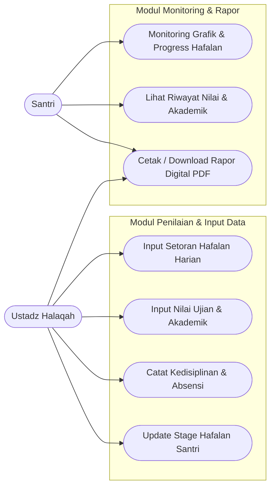
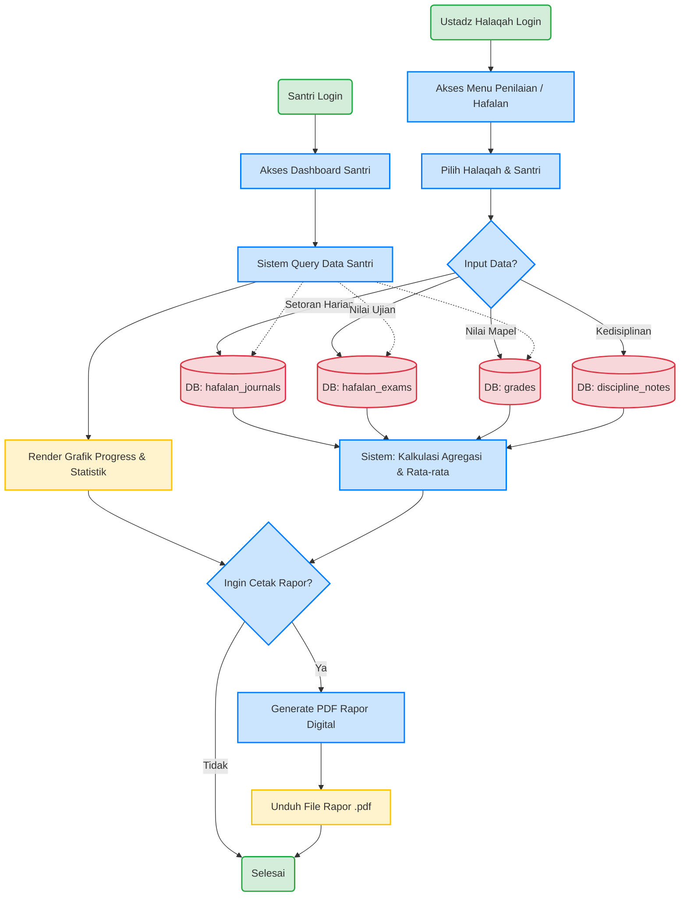

# Analisis Sistem Penilaian, Setoran Hafalan, dan Monitoring Progress SIAKAD

Dokumen ini merupakan hasil analisis basis kode (codebase) project Laravel SIAKAD, khususnya pada modul Penilaian, Setoran Hafalan, dan Monitoring Progress Santri. Analisis ini ditujukan untuk kebutuhan Capstone Project dan mencakup arsitektur interaksi dari sisi **Ustadz Halaqah** dan **Santri**.

---

## 1. Identifikasi Aktor & Hak Akses

Berdasarkan struktur routing (`routes/web.php`) dan controller (`app/Http/Controllers/Siakad/`), terdapat dua aktor utama dalam modul ini:

1. **Ustadz Halaqah (`ustadz_halaqah`)**: 
   Aktor yang bertanggung jawab sebagai pengajar/pembimbing. Memiliki hak untuk mengelola kelompok halaqah yang diampunya, menginput absensi harian, setoran hafalan (ziyadah/murajaah), nilai ujian hafalan, nilai mata pelajaran akademik, mencatat pelanggaran/prestasi (kedisiplinan), serta mengupdate stage hafalan santri.
2. **Santri (`santri`)**: 
   Aktor yang bertindak sebagai peserta didik. Memiliki hak akses *read-only* untuk memantau grafik/progress hafalan, melihat riwayat nilai akademik, kehadiran, kedisiplinan, serta mengunduh rekap hasil belajar (rapor digital).

### Access Control Matrix (Matriks Hak Akses Fitur)

| Fitur / Modul | Ustadz Halaqah | Santri |
| :--- | :---: | :---: |
| **Dashboard Info & Insight** | ✔️ Lihat statistik halaqahnya | ✔️ Lihat progres diri sendiri |
| **Absensi Halaqah** | ✔️ Input & Update | ✔️ Read Only (Riwayat sendiri) |
| **Setoran Hafalan (Jurnal)** | ✔️ Input (Ziyadah/Murojaah) | ✔️ Read Only (Riwayat sendiri) |
| **Ujian Hafalan** | ✔️ Input Nilai | ✔️ Read Only (Nilai sendiri) |
| **Nilai Akademik (Grade)** | ✔️ Input Nilai Mapel | ✔️ Read Only (Nilai per mapel) |
| **Catatan Kedisiplinan** | ✔️ Input (Pelanggaran/Prestasi) | ✔️ Read Only (Catatan sendiri) |
| **Update Stage Hafalan** | ✔️ Update Stage | ❌ Akses Ditolak |
| **Rekap Bulanan / Rapor** | ✔️ Read & Generate | ✔️ Read & Download Rapor PDF |

---

## 2. Use Case Diagram

Berikut adalah Use Case Diagram yang memetakan interaksi kedua aktor dengan sistem, dikelompokkan berdasarkan area modul.

---

## 3. Skenario Use Case Detail

Berikut adalah skenario terperinci untuk 4 aktivitas inti pada sistem:

### UC-01: Input Setoran Hafalan Santri (oleh Ustadz)
| Atribut | Deskripsi |
| :--- | :--- |
| **Aktor Utama** | Ustadz Halaqah |
| **Pre-condition** | Ustadz sudah login ke sistem dan memiliki data santri di dalam halaqah-nya. |
| **Main Flow** | 1. Ustadz mengakses menu "Jurnal Hafalan". 2. Sistem menampilkan daftar halaqah yang diampu ustadz. 3. Ustadz memilih halaqah dan menekan tombol input setoran. 4. Ustadz memilih nama santri, tanggal, jenis setoran (ziyadah/murojaah), juz, surah, rentang ayat, kualitas bacaan (Mumtaz, Jayyid, dsb), dan catatan tambahan. 5. Ustadz menekan tombol Simpan. 6. Sistem memvalidasi data dan menyimpannya ke tabel `hafalan_journals`. 7. Sistem menampilkan notifikasi "Jurnal hafalan berhasil disimpan". |
| **Alternative Flow**| Jika validasi gagal (misal field wajib tidak diisi), sistem menampilkan pesan error pada form dan data tidak disimpan. |
| **Post-condition** | Data setoran hafalan harian santri terekam dan langsung mempengaruhi metrik/grafik pada dashboard Santri. |

### UC-02: Input & Rekap Nilai Akademik/Karakter (oleh Ustadz)
| Atribut | Deskripsi |
| :--- | :--- |
| **Aktor Utama** | Ustadz Halaqah |
| **Pre-condition** | Ustadz sudah login dan mata pelajaran / kategori nilai telah diset oleh Admin. |
| **Main Flow** | 1. Ustadz mengakses menu "Nilai" atau "Ujian Hafalan". 2. Ustadz memilih halaqah dan mata pelajaran / jenis ujian. 3. Sistem menampilkan daftar santri pada halaqah tersebut. 4. Ustadz memasukkan nilai (angka 0-100) dan tipe nilai (harian, tugas, UTS, UAS). 5. Ustadz menekan tombol Simpan. 6. Sistem melakukan iterasi, memvalidasi form array, lalu menyimpan ke tabel `grades` (atau `hafalan_exams`). 7. Sistem menampilkan notifikasi sukses. |
| **Alternative Flow**| Jika nilai yang dimasukkan berada di luar rentang validasi (misal > 100), sistem menolak inputan dan menampilkan pesan validasi error. |
| **Post-condition** | Data nilai tersimpan di database dan rata-rata (average) santri terbarui secara otomatis saat dilihat. |

### UC-03: Monitoring Grafik Capaian Hafalan & Progress (oleh Santri)
| Atribut | Deskripsi |
| :--- | :--- |
| **Aktor Utama** | Santri |
| **Pre-condition** | Santri sudah login dengan akun yang valid dan terhubung ke data `Santri`. |
| **Main Flow** | 1. Santri mengakses halaman "Dashboard" atau menu khusus "Hafalan". 2. Sistem mengambil data `hafalan_journals` dan `hafalan_exams` milik santri tersebut berdasarkan bulan dan tahun aktif. 3. Sistem melakukan agregasi data (menghitung total Ziyadah, total Murojaah, sebaran kualitas hafalan, rata-rata nilai). 4. Sistem juga memanggil atribut `stage_info` santri untuk menghitung persentase penyelesaian hafalan Al-Quran. 5. Sistem menyajikan ringkasan tersebut dalam bentuk dashboard visual (grafik/angka statistik). |
| **Alternative Flow**| Jika santri belum memiliki data setoran pada bulan berjalan, sistem menampilkan grafik kosong (angka 0) dengan pesan "Belum ada data setoran hafalan". |
| **Post-condition** | Santri mendapatkan informasi capaian belajar secara real-time dan transparan. |

### UC-04: Cetak / Download Rapor Digital PDF (oleh Santri / Ustadz)
| Atribut | Deskripsi |
| :--- | :--- |
| **Aktor Utama** | Santri / Ustadz Halaqah |
| **Pre-condition** | Telah ada data setoran hafalan, absensi, dan nilai ujian dalam periode waktu tertentu (misal: Rekap Bulanan/Semester). |
| **Main Flow** | 1. Pengguna masuk ke menu Rekap Bulanan / Nilai. 2. Pengguna memilih periode (Bulan / Semester) dan menekan tombol "Download Rapor / Cetak PDF". 3. Sistem mengumpulkan semua data agregasi: total absensi, rata-rata nilai akademik, riwayat hafalan, dan poin kedisiplinan. 4. Sistem me-render view Blade (HTML) yang dikonversi menjadi file PDF. 5. Sistem mengirimkan file PDF tersebut sebagai respons unduhan ke browser pengguna. |
| **Alternative Flow**| Jika generator PDF gagal me-render akibat timeout data terlalu besar, sistem mengembalikan pesan error. |
| **Post-condition** | File PDF Rapor/Rekapitulasi berhasil terunduh di perangkat pengguna. |

---

## 4. Flowchart Alur Sistem Penilaian & Progress

Berikut adalah gambaran alur data dari input penilaian oleh Ustadz hingga penyajian progress di sisi Santri.

---
**Catatan Akhir**: Arsitektur pada kode ini mengandalkan relasi tabel pivot (`halaqah_santri`) untuk memvalidasi hak akses ustadz terhadap santri. Fitur kalkulasi agregasi data dilakukan secara real-time pada layer Controller (misalnya di `DashboardController` dan `RekapBulananController`) menggunakan fitur Collections di Laravel untuk disajikan kepada user.
