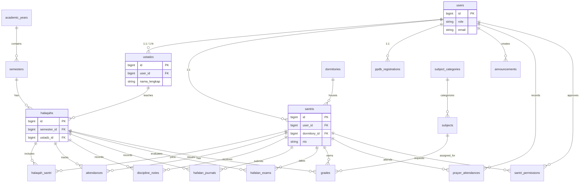

# Database Entity Relationship Diagram (ERD) & Kamus Data
Berdasarkan analisis file `rtq_kawali.sql`, berikut adalah pemetaan struktur database untuk sistem SIAKAD RTQ Kawali.

## 1. Entity Relationship Diagram (ERD)
Diagram berikut merepresentasikan relasi antar tabel utama di dalam database menggunakan notasi Mermaid.js.

---

## 2. Kamus Data (Data Dictionary)

Berikut adalah detail struktur dan relasi dari tabel-tabel utama (berdasarkan DDL & Constraints pada SQL):

### A. Tabel Pengguna & Entitas Utama
| Nama Tabel | Deskripsi | Primary Key | Foreign Key | Keterangan Tambahan |
|---|---|---|---|---|
| `users` | Menyimpan data autentikasi semua pengguna | `id` | - | Kolom `role` menentukan hak akses (`admin`, `ustadz_ppdb`, `calon_santri`, `ustadz_halaqah`, `santri`). |
| `ustadzs` | Data detail profil Ustadz / Pengajar | `id` | `user_id` -> `users(id)` | Berelasi ke `halaqahs` sebagai pengampu. |
| `santris` | Data detail profil Santri (Peserta Didik) | `id` | `user_id` -> `users(id)` `dormitory_id` -> `dormitories(id)` | Terdapat field `nis` (Unique) dan `rfid_uid` (Unique). |
| `ppdb_registrations` | Data pendaftaran Calon Santri | `id` | `user_id` -> `users(id)` | Digunakan untuk modul PPDB. |
| `dormitories` | Data Asrama / Kamar | `id` | - | - |

### B. Tabel Akademik & Kurikulum
| Nama Tabel | Deskripsi | Primary Key | Foreign Key | Keterangan Tambahan |
|---|---|---|---|---|
| `academic_years` | Tahun Ajaran (contoh: 2026/2027) | `id` | - | - |
| `semesters` | Semester (Ganjil/Genap) | `id` | `academic_year_id` -> `academic_years(id)` | - |
| `subject_categories`| Kategori Mata Pelajaran | `id` | - | (Diniyyah, Tahfidz, Umum) |
| `subjects` | Mata Pelajaran | `id` | `category_id` -> `subject_categories(id)`| Berelasi dengan tabel `grades`. |
| `halaqahs` | Kelompok belajar / Halaqah | `id` | `semester_id` -> `semesters(id)` `ustadz_id` -> `ustadzs(id)`| Modul pusat untuk input nilai & presensi. |
| `halaqah_santri` | Tabel Pivot Santri dan Halaqah | `halaqah_id`, `santri_id` | `halaqah_id` -> `halaqahs(id)` `santri_id` -> `santris(id)` | Hubungan Many-to-Many. |

### C. Tabel Transaksi / Jurnal (Modul Penilaian & Monitoring)
| Nama Tabel | Deskripsi | Primary Key | Foreign Key | Keterangan Tambahan |
|---|---|---|---|---|
| `attendances` | Presensi harian santri per halaqah | `id` | `halaqah_id`, `santri_id` | `status`: hadir, sakit, izin, alpha. |
| `discipline_notes` | Catatan Pelanggaran/Prestasi santri | `id` | `halaqah_id`, `santri_id` | Mempengaruhi poin kedisiplinan. |
| `hafalan_journals` | Jurnal hafalan harian (ziyadah/murojaah)| `id` | `halaqah_id`, `santri_id` | Terdapat kolom `juz`, `surat`, `kualitas`. |
| `hafalan_exams` | Nilai Ujian Hafalan Al-Quran | `id` | `halaqah_id`, `santri_id` | Evaluasi per juz, semester, atau bulanan. |
| `grades` | Nilai Mata Pelajaran / Akademik | `id` | `halaqah_id`, `santri_id`, `subject_id` | Tipe: tugas, uts, uas, harian. |
| `prayer_attendances`| Presensi Shalat Berjamaah (RFID) | `id` | `santri_id` `recorded_by` -> `users(id)` | Modul monitoring ibadah shalat wajib. |
| `santri_permissions`| Perizinan Santri (Pulang/Sakit dll) | `id` | `santri_id` `approved_by` -> `users(id)` | Modul perizinan keluar pondok/asrama. |

### D. Tabel Sistem Pendukung
| Nama Tabel | Deskripsi | Primary Key | Foreign Key | Keterangan Tambahan |
|---|---|---|---|---|
| `announcements` | Pengumuman sistem | `id` | `user_id` -> `users(id)` | Target: semua, ustadz, santri. |
| `app_settings` | Konfigurasi sistem | `id` | - | - |
